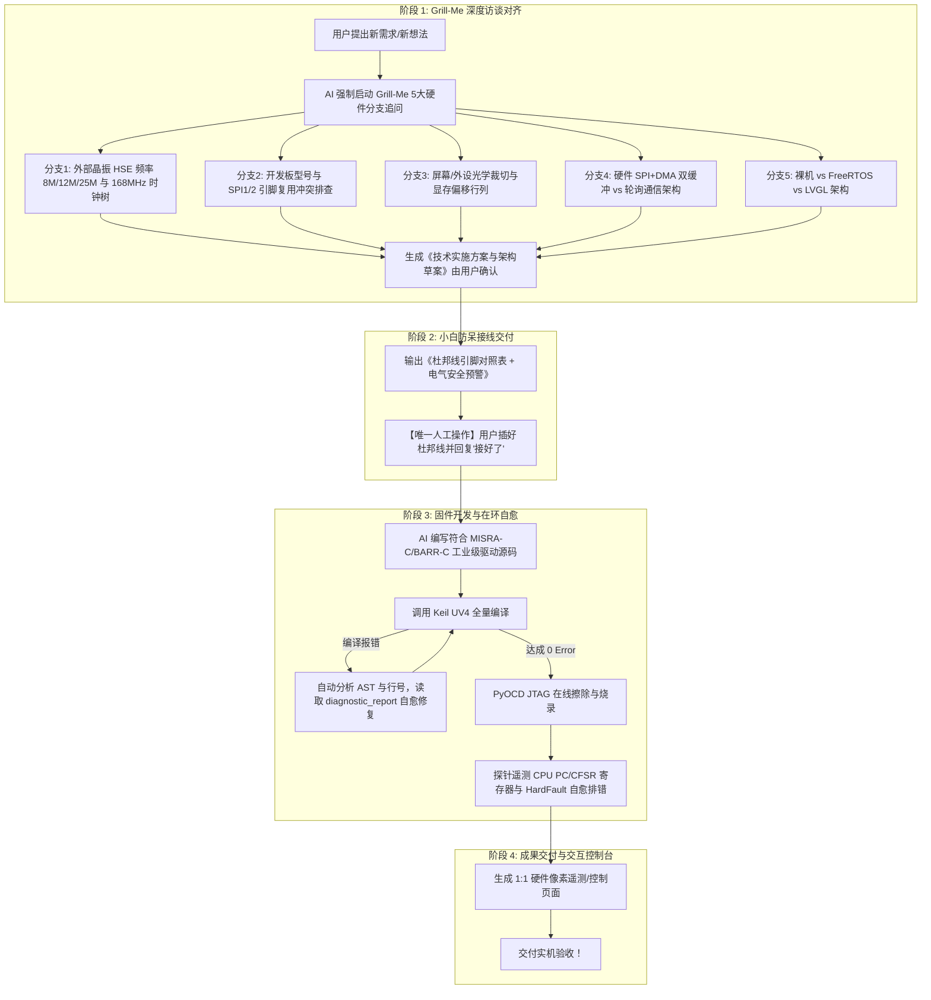

# 🚀 STM32 硬件在环全流程固件架构师与自愈开发套件
### (STM32 AutoDebug & Firmware Copilot Universal Kit)

> **核心信仰**：**谋定而后动，系统稳定与硬件安全压倒一切。**  
> **拒绝盲目动手！** 从用户的模糊想法出发，强制执行 **Grill-Me 5大分支深度访谈**（时钟晶振、引脚冲突、面板偏移、DMA驱动、RTOS），输出**小白防呆型硬件接线指南**。用户只需负责照图插线，剩下的代码编写、Keil 0 Error 编译自愈、JTAG 在线烧录、CPU 寄存器遥测与交互控制台全部由 AI 全自动闭环完成！

---

## 🌟 核心全生命周期 (The 4-Stage Lifecycle)



---

## 📋 Grill-Me 5大硬件分支访谈标准 (Hardware Decision Tree)

在进入任何编码或接线前，AI 必须严格执行以下追问与排查：

1. ⏱️ **时钟源与外部晶振 (HSE)**：
   - 确切晶振频率（`8.000MHz` / `12.000MHz` / `25.000MHz`）；
   - 精准计算 PLL 倍频系数（$\text{SYSCLK} = \frac{\text{HSE}}{\text{PLL\_M}} \times \frac{\text{PLL\_N}}{\text{PLL\_P}}$），杜绝超频死机或延时倍速失效。
2. 🔌 **开发板型号与引脚冲突排查**：
   - 核对板载资源（正点原子 / 野火 / 自定义板），排查目标引脚（如 `PA5`/`PA7`）是否已被板载 SPI Flash、以太网 PHY、板载 LED 占用。
3. 🖥️ **屏幕光学与显存偏移行列**：
   - 驱动芯片子型号（ST7735S / ST7789 / SSD1306）；
   - 物理裁切与显存偏移（如 0.96寸 80x160 的 $X_{\text{offset}}=26, Y_{\text{offset}}=1$）；
   - IPS 颜色反转（`0x21 INVON`）。
4. ⚡ **通信时序与驱动模式**：
   - 硬件 `SPI+DMA` 双缓冲异步高速刷屏（60 FPS） vs 软件模拟 SPI 轮询。
5. 🏗️ **系统框架与图形栈**：
   - 裸机前后台轮询、FreeRTOS 多任务或 LVGL 9.0 嵌入式图形界面。

---

## 🛠️ 新电脑 30 秒一键初始化 (New PC Setup)

当你在一台全新的电脑上克隆本项目时：

### 第 1 步：克隆代码仓库
```bash
git clone https://github.com/TaoCosmo-Dev/STM32_AutoDebug_Universal_Kit.git
cd STM32_AutoDebug_Universal_Kit
```

### 第 2 步：双击运行一键环境初始化
直接双击运行：
👉 **`setup_env.bat`**
- ⚡ 自动通过国内清华源高速安装 `pyocd`、`pyserial`、`websockets` 依赖；
- ⚡ 自动检索 Windows 注册表与全盘驱动器定位 Keil `UV4.exe`；
- ⚡ 自动识别已连接的硬件调试探针（CMSIS-DAP / ST-Link）并完成自检。

---

## 🎮 接入任意新项目 / 存量工程

### 方式 A：1秒拖拽注入（最简单）
将任意 Keil / CubeMX 工程文件夹直接拖拽到：
👉 **`inject_to_project.bat`**
- 1 秒自动将 AI 规范（`AGENTS.md`、`.cursorrules`）与自愈引擎注入目标工程；
- 在新项目窗口对 AI 说：“*根据 AGENTS.md 规范开始编写代码并自动验证*”，AI 立即全自动接管！

### 方式 B：配置全局 MCP Server（零拷贝通用）
在 **Cursor**、**Windsurf** 或 **Claude Code** 的 MCP 配置中添加：
```json
{
  "mcpServers": {
    "stm32-copilot": {
      "command": "python",
      "args": [
        "C:\\Users\\77517\\Desktop\\STM32_AutoDebug_Universal_Kit\\mcp_server.py"
      ]
    }
  }
}
```

---

## 📁 目录结构说明

```
STM32_AutoDebug_Universal_Kit/
├── setup_env.bat             # [1-Click] 新电脑一键环境初始化脚本
├── setup_env.ps1             # [1-Click] PowerShell 版本一键初始化脚本
├── inject_to_project.bat      # [1-Click] 存量/新工程拖拽注入器
├── inject_to_project.py       # 工程注入核心 Python 逻辑
├── mcp_server.py             # 跨编辑器通用 MCP 服务端
├── AGENTS.md                 # 通用 AI 智能体开发规范（内置 Grill-Me SOP）
├── .cursorrules              # Cursor / Windsurf 专用规则
├── autodebug/                # 自动化构建、烧录、寄存器遥测核心引擎
│   ├── config.py             # 注册表扫描与探针自适应模块
│   ├── builder.py            # Keil UV4 驱动与编译日志解析器
│   ├── hardware_probe.py     # PyOCD JTAG 探针与寄存器读取器
│   ├── fault_analyzer.py     # Cortex-M HardFault 智能故障诊断器
│   └── symbol_resolver.py    # AXF/ELF 符号与源码行号映射器
└── templates/                # 标准规范模板库
    ├── grill_me_hardware_checklist.md # 5大分支 Grill-Me 访谈标准模板
    └── wiring_guide_template.md       # 小白防呆型硬件接线规范模板
```

---

## 📄 开源许可证 (License)
本项目基于 [MIT License](LICENSE) 开源，允许任何个人或企业免费使用、修改与商用。
