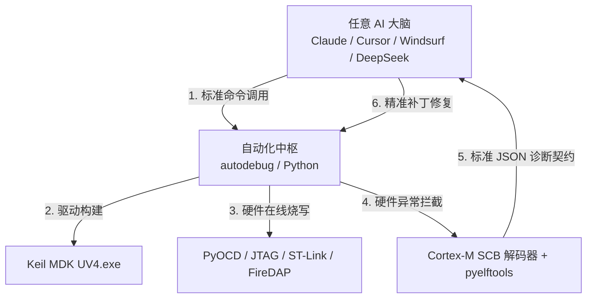

# STM32 全自动“调试—修复”通用化迁移与接入指南

> **核心目标**：让你在 **任意电脑（换电脑/换系统）**、以及 **任意 AI（Cursor / Claude Code / Windsurf / Aider / DeepSeek / 本地大模型）** 下，都能 100% 复现这套“自动写码 $\rightarrow$ 自动编译 $\rightarrow$ 自动烧录 $\rightarrow$ 自动捕获 HardFault $\rightarrow$ 自动改码自愈”的闭环！

---

## 1. 通用化核心原理解密：为什么它能跨 AI 与跨电脑？

本系统的设计核心是 **“大脑与四肢完全解耦”**：



- **四肢（执行层）**：是一套标准的 Python 跨平台库（`autodebug`），它直接和 Keil、ST-Link、J-Link 通信，不受任何特定 AI 绑死。
- **神经（协议层）**：统一的结构化输出 `diagnostic_report.json`，把硬件崩溃精准翻译为“文件名、行号、SCB 根因、代码切片”。
- **大脑（思考层）**：任何 AI 只要能读写文件、能运行命令行（Terminal），就能无缝驱动这套系统！

---

## 2. 换一台新电脑时：如何 3 步快速部署？

当你换到新电脑、笔记本或别人的电脑时，只需 3 步（耗时 1 分钟）：

### 步骤 1：把本工具包拷过去
直接将本文件夹 `STM32_AutoDebug_Universal_Kit` 复制到新电脑的任意目录（或通过 Git 仓库 clone）。

### 步骤 2：一键安装基础环境
双击运行 `setup_env.bat`（或在终端运行）：
```bash
pip install pyocd pyelftools pyserial pyyaml pylink-square
```

### 步骤 3：核对 `autodebug/config.yaml` 路径
打开 `autodebug/config.yaml`，确认新电脑上的 Keil 安装路径（如 `C:\Keil_v5\UV4\UV4.exe`）和芯片型号。

---

## 3. 换不同 AI 时：如何一键接入？

### 方式一：在 Cursor / Windsurf / VS Code 中使用（推荐）
1. 将本工具包内的 [`AGENTS.md`](file:///C:/Users/77517/Desktop/STM32_AutoDebug_Universal_Kit/AGENTS.md) 复制到你的任意 STM32 工程根目录下，重命名为 `.cursorrules`（Cursor 专用）或保留 `AGENTS.md`（Windsurf 专用）。
2. 在对话框中对 AI 说：
   > “请根据 `.cursorrules` 的规范，修改我的 STM32 代码，并在修改后自动调用 `autodebug` 编译和验证，直到测试通过。”

### 方式二：在 Claude Code / Aider / 命令行 AI 工具中使用
1. 启动命令行 AI：`claude` 或 `aider`。
2. 初始提示词直接输入：
   > “本项目已配置 STM32 闭环自动测试工具。每次你修改代码后，必须运行 `python autodebug/run_autodebug.py --project MDK-ARM/project.uvprojx`。如果报错，请读取 `diagnostic_report.json` 自行修复。”

### 方式三：通过 MCP (Model Context Protocol) 插件化接入
对于支持 MCP 协议的客户端（如 Claude Desktop / Cursor MCP），在配置文件中添加：
```json
{
  "mcpServers": {
    "stm32_autodebug": {
      "command": "python",
      "args": ["C:/Users/77517/Desktop/STM32_AutoDebug_Universal_Kit/mcp_server.py"]
    }
  }
}
```
此时任何 AI 都会原生拥有 `build_keil_project`、`flash_firmware`、`diagnose_crash` 等硬件级原子工具！

---

## 4. 目录结构与工具索引

```
STM32_AutoDebug_Universal_Kit/
├── autodebug/                  # 核心调度中枢与硬件解析库
│   ├── builder.py              # Keil UV4 自动化编译与 0 Error 校验
│   ├── hardware_probe.py       # PyOCD / ST-Link / J-Link / FireDAP 烧录与寄存器捕获
│   ├── fault_analyzer.py       # Cortex-M SCB 状态解码与堆栈帧还原
│   ├── symbol_resolver.py      # DWARF 符号秒级反解 (地址 -> 源码行)
│   ├── diagnostic_report.py    # 标准 JSON 诊断上下文生成器
│   ├── serial_monitor.py       # 串口高速流监听
│   ├── config.yaml             # 工具链与芯片硬件配置文件
│   └── engine.py               # 闭环状态机主调度器
├── mcu_support/                # 单片机端支持库
│   ├── cm_backtrace_lite.h     # 嵌入式轻量级异常跳板头文件
│   └── cm_backtrace_lite.c     # 异常打印与寄存器抓取实现
├── AGENTS.md                   # 供给任意 AI 读取的标准行为规范与系统提示词
├── mcp_server.py               # 标准 MCP 协议服务接口
├── setup_env.bat               # Windows 一键环境部署脚本
└── README_UNIVERSAL.md         # 本指南文件
```
