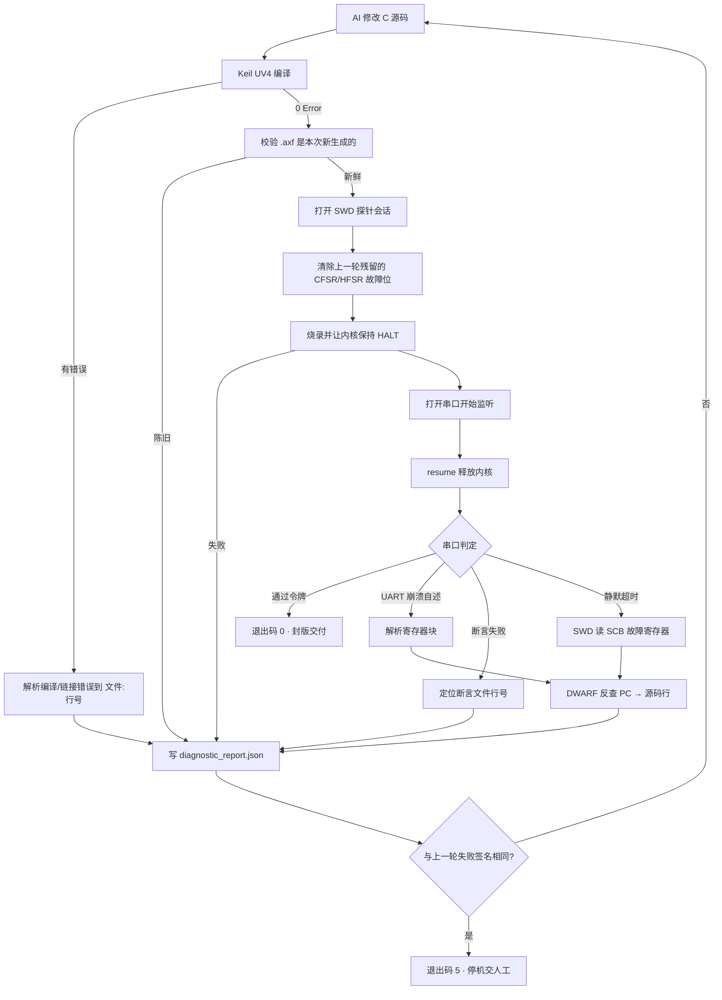

# 进阶手册 · STM32 AutoDebug Universal Kit

> 面向工程师。小白入门请看 [README](../README.md)，那边全程无需命令行。

## 目录

- [闭环时序：为什么顺序是关键](#闭环时序为什么顺序是关键)
- [退出码契约](#退出码契约)
- [命令行用法](#命令行用法)
- [MCP Server 接入](#mcp-server-接入)
- [固件侧接入 cm_backtrace_lite](#固件侧接入-cm_backtrace_lite)
- [诊断报告结构](#诊断报告结构)
- [自愈护栏](#自愈护栏)
- [完整配置项](#完整配置项)
- [离线自测](#离线自测)
- [Grill-Me 硬件访谈](#grill-me-硬件访谈)
- [模块职责](#模块职责)
- [排错速查](#排错速查)
- [v2.0 修复了什么](#v20-修复了什么)

---

## 闭环时序：为什么顺序是关键



**两处顺序不能调换，否则闭环必然假成功或永远超时：**

1. **先 halt 再开串口，最后才 resume。**
   固件复位后几十毫秒就会打印启动横幅。若在 `flash()` 里直接 `reset_and_run()`，
   等 pyserial 打开 COM 口时通过令牌早已冲进虚空 —— 表现为每轮都超时，而代码其实是好的。

2. **烧录失败必须立即中止本轮。**
   否则串口监听到的是**上一版固件**的行为，据此生成的报告会把 AI 引向完全错误的修改方向。

---

## 退出码契约

**严禁凭日志文字判断成败。** 只在「编译 0 Error + 烧录成功 + 实机串口通过令牌」三者同时成立时返回 `0`。

| 退出码 | 状态 | 含义 | 该做什么 |
|:---:|---|---|---|
| **0** | `TEST_PASSED` | 编译 + 烧录 + 实机验收全通过 | 封版交付 |
| **1** | `BUILD_FAILED` | 编译 / 链接错误 | 按报告改源码 |
| **2** | `FLASH_FAILED` | 探针 / 接线 / 供电 / 读保护 | **不是代码问题**，查硬件 |
| **3** | `HARD_FAULT`·`ASSERTION_FAILED` | 运行时崩溃，已定位到源码行 | 按根因改源码 |
| **4** | `TIMEOUT`·`SERIAL_UNAVAILABLE` | 没等到通过令牌 / 串口打不开 | 查串口重定向与测试路径 |
| **5** | `STALLED` | 连续两轮完全相同的失败 | **停止盲改**，升级人工 |
| **6** | `CONFIG_ERROR` | 找不到 Keil 工具链 | 装环境或改配置 |

`--json` 输出：

```json
{
  "status": "HARD_FAULT",
  "success": false,
  "exit_code": 3,
  "report_path": "MDK-ARM/diagnostic_report.json",
  "summary": "NULL Pointer Dereference: Access to NULL or a near-zero offset at 0x00000004.",
  "signature": "FAULT|HardFault|PC=0x08000B12|CFSR=0x00008200",
  "repeated_failure": false,
  "next_actions": ["空指针解引用。检查该地址附近的结构体指针是否在使用前完成初始化 ..."]
}
```

---

## 命令行用法

```bash
python run_autodebug.py --project MDK-ARM/App.uvprojx          # 完整闭环
python run_autodebug.py --project MDK-ARM/App.uvprojx --json   # 机器可读
python run_autodebug.py --project MDK-ARM/App.uvprojx --no-flash   # 只编译
python run_autodebug.py --project MDK-ARM/App.uvprojx --rebuild    # 全量重编译
python run_autodebug.py --project MDK-ARM/App.uvprojx --target Release --mcu stm32f407zg
python run_autodebug.py --project MDK-ARM/App.uvprojx --port COM6 --baud 115200 --timeout 30
python run_autodebug.py --list-devices                          # 列探针与串口
```

省略 `--project` 时会在当前目录向下搜索 `.uvprojx`（优先 `MDK-ARM/`），**不会向上跑到隔壁工程**。

---

## MCP Server 接入

`mcp_server.py` 是真正的 MCP stdio 服务端（JSON-RPC 2.0，protocol `2024-11-05`，无额外依赖）。

```json
{
  "mcpServers": {
    "stm32-copilot": {
      "command": "python",
      "args": ["C:\\path\\to\\STM32_AutoDebug_Universal_Kit\\mcp_server.py"]
    }
  }
}
```

自检：`python mcp_server.py test` 应输出已注册的 7 个工具。

| 工具 | 作用 |
|---|---|
| `stm32_closed_loop` | 主入口：完整闭环，返回可直接执行的修复提示 |
| `stm32_build` | 只编译，返回结构化编译/链接错误 |
| `stm32_flash` | 烧录（`halt_after` 可保持内核 halt） |
| `stm32_read_registers` | halt 目标并读核心 + SCB 故障寄存器；带 `axf_path` 时直接给根因与源码行 |
| `stm32_diagnose_address` | 裸地址（PC/LR）→ `文件:行号:函数` + 代码片段 |
| `stm32_list_devices` | 列出探针与串口 |
| `stm32_inject` | 注入工具链到指定工程目录 |

> stdout 只走协议帧，所有日志走 stderr；引擎内部的 print 会被重定向，不会污染协议。

---

## 固件侧接入 cm_backtrace_lite

没有这三步，脚本只能告诉你"超时了"，给不出根因。

### 1. 通过令牌

```c
printf("[ALL TESTS PASSED]\r\n");   /* 或 TESTS_PASSED / [PASS]，可在配置里自定义 */
```

### 2. 崩溃自述（无需探针也能定位崩溃）

把 `mcu_support/cm_backtrace_lite.c` 加入 Keil 工程，实现一个**阻塞式、寄存器级**的字节输出，
并在 `main()` 最前面调用 `cm_backtrace_init()`：

```c
#include "cm_backtrace_lite.h"

void cm_backtrace_putchar(char c)                 /* 弱符号，直接实现即可覆盖 */
{
    while (!(USART1->SR & USART_SR_TXE)) { }      /* F1/F4 用 SR；G0/G4/H7 用 ISR */
    USART1->DR = (uint8_t)c;
}

int main(void)
{
    cm_backtrace_init();                          /* 使能子异常分类 + 除零陷阱 */
    ...
}
```

> ⚠️ **严禁在故障处理里用 `printf` / `HAL_UART_Transmit`。**
> 它们的超时依赖 SysTick，而 HardFault 优先级为 −1 时 SysTick 根本进不了中断，
> `HAL_GetTick()` 永不递增 → 超时循环死等 → **一个字节都吐不出来**。
> 本文件因此完全不用 stdio，只用手写的十六进制格式化 + 阻塞写寄存器。

`cm_backtrace_lite.c` 同时提供了 `HardFault_Handler` 的**汇编胶水**（AC5 `__asm` 与 AC6/GCC `naked` 双版本），
按 `EXC_RETURN` bit2 选出正确的 MSP/PSP 再进 C 函数 —— 直接在 C 处理函数里读 `sp` 拿到的是处理函数自己的栈，不是异常栈帧。

> 若链接器报 `HardFault_Handler` 重复定义：删掉 `stm32xxxx_it.c` 里那个空实现（正是它把崩溃吞掉了），
> 或设 `#define CM_BACKTRACE_PROVIDE_HANDLER 0` 自行调用 `cm_backtrace_fault_handler()`。

崩溃时串口输出：

```
[AUTODEBUG_CRASH_START]
LR_EXC = 0xFFFFFFF9 (MSP)
R0 = 0x00000000, R1 = 0x20000100, R2 = 0x00000002, R3 = 0x00000003
R12 = 0x0000000C, LR = 0x08000AA5, PC = 0x08000B12, XPSR = 0x61000000
CFSR = 0x00008200, HFSR = 0x40000000, BFAR = 0x00000004, MMFAR = 0x00000000, DFSR = 0x00000000
[Backtrace] >> 0x08000B12 0x08000AA5
[AUTODEBUG_CRASH_END]
```

### 3. 断言

```c
AUTO_ASSERT(hi2c->State == HAL_I2C_STATE_READY);
```

HAL 的 `assert_param` 与 C99 `assert` 格式同样能被解析。

### 可配置宏

| 宏 | 默认 | 说明 |
|---|:---:|---|
| `CM_BACKTRACE_PROVIDE_HANDLER` | 1 | 是否提供 HardFault/子异常处理函数与汇编胶水 |
| `CM_BACKTRACE_PROVIDE_SUBFAULTS` | 1 | 使能并接管 MemManage / BusFault / UsageFault |
| `CM_BACKTRACE_TRAP_DIV0` | 1 | 使能 `SCB->CCR.DIV_0_TRP`，否则除零静默返回 0 |
| `CM_BACKTRACE_TRAP_UNALIGNED` | 0 | 使能非对齐访问陷阱（部分厂商库依赖非对齐访问，默认关）|
| `CM_BACKTRACE_RESET_AFTER_DUMP` | 0 | 打印后复位而非停机（停机才能让探针继续读故障态）|

---

## 诊断报告结构

工程根目录 `diagnostic_report.json`（最新一轮）+ `.autodebug/iter_NN_*.json`（历史归档）。

| 字段 | 说明 |
|---|---|
| `status` | `BUILD_FAILED` / `FLASH_FAILED` / `HARD_FAULT` / `ASSERTION_FAILED` / `TIMEOUT` / `SERIAL_UNAVAILABLE` / `TEST_PASSED` |
| `signature` | 失败指纹，用于停滞检测（编译错误指纹 / `PC+CFSR` 指纹）|
| `repeated_failure` | 与上一轮完全相同 → 上次修改没生效 |
| `compiler_errors[]` | `file_path` / `line_number` / `error_code` / `message` |
| `fault_diagnostics` | CFSR/HFSR 原值、解码标志、栈帧、`fault_address`、`suggested_fix` |
| `source_context` | 崩溃点文件、行号、函数名、前后 5 行代码 |
| `next_actions[]` | 结构化处置建议 |
| `ai_repair_prompt` | 给 AI 直接执行的中文修复指令（Markdown）|

`ai_repair_prompt` 样例：

```markdown
# STM32 运行时硬件故障深度诊断报告（迭代 2）
**故障类型**: `HardFault`
**数据来源**: 固件 UART 自述
**根本原因**: NULL Pointer Dereference: Access to NULL or a near-zero offset at 0x00000004.

## 2. SCB 故障状态寄存器
- **CFSR**: `0x00008200`
- **故障地址（有效）**: `0x00000004`
- **置位标志**:
  - PRECISERR: Precise data bus error (NULL or wild pointer)
  - BFARVALID: BFAR holds a valid fault address

## 3. 源码定位
**崩溃点**: `../User/lcd_st7789.c:88`（函数 `LCD_WriteData`）
```c
     83 | void LCD_WriteData(LCD_HandleTypeDef *lcd, uint8_t data)
>>>  88 |     lcd->spi->DR = data;
```
```

> `故障地址（有效）` 只在 CFSR 的 `BFARVALID` / `MMARVALID` 置位时出现。
> 寄存器无效时如实写"无效（多为 imprecise 错误）"，**不猜**。

---

## 自愈护栏

| 护栏 | 机制 |
|---|---|
| **不可回滚** | 每轮 AI 修改前 `git stash create` + `git tag autodebug/iter-NN`。**不动工作区、不动索引、不在分支上产生提交**；回退用 `git checkout <sha> -- .` |
| **来回震荡** | 报告带 `signature`，连续 `stall_threshold`(默认 2) 轮相同 → 退出码 5 停机交人工 |
| **失忆** | `.autodebug/history.jsonl` 逐轮记录；`state.json` 让**跨进程调用**（AI 每次单独跑一次脚本）也能延续迭代计数与停滞检测 |

---

## 完整配置项

优先级：命令行参数 > 工程根 `autodebug.config.yaml` > 包内 `autodebug/config.yaml`。

```yaml
keil:
  uv4_path: null          # null = 注册表 + 常见目录 + PATH 自动探测（写错也会自动回退）
  fromelf_path: null

debugger:
  type: "pyocd"           # "pyocd" | "jlink"
  target_override: null   # null = 从 .uvprojx <Device> 自动推导
  probe_id: null          # null = 第一个连接的探针，绝不弹交互菜单
  frequency_hz: 4000000
  connect_mode: "under-reset"   # 固件把 SWD 引脚复用掉时仍能连上
  flash_address: 0x08000000     # J-Link 裸烧录基址

build:
  timeout_seconds: 600    # HAL 工程冷全量编译远超 120s
  rebuild: false          # false = 增量(-b)，true = 全量(-r)
  kill_uv4_on_timeout: true   # 弹模态框卡死时杀掉 UV4，避免锁死工程
  fail_on_stale_axf: true     # 本次没生成新镜像就判失败
  log_encodings: ["utf-8", "gbk", "cp936", "latin-1"]

serial:
  port: null              # null = 自动嗅探（排除蓝牙口，优先 CH340/CP210x/ST-Link VCP）
  baudrate: 115200
  timeout_seconds: 15
  boot_grace_seconds: 0.2
  exclude_keywords: ["bluetooth", "蓝牙"]

test:
  max_repair_iterations: 5
  pass_keywords: ["[ALL TESTS PASSED]", "TESTS_PASSED", "[PASS]"]
  fail_keywords: ["[TEST FAILED]", "ASSERTION_FAILED", "[AUTODEBUG_CRASH_START]"]
  crash_begin_marker: "[AUTODEBUG_CRASH_START]"
  crash_end_marker: "[AUTODEBUG_CRASH_END]"

loop:
  git_snapshot: true
  archive_reports: true
  archive_dir: ".autodebug"
  stall_threshold: 2
  halt_target_on_finish: false
```

---

## 离线自测

无需 Keil、无需探针、无需板子：

```bash
python -m unittest discover -s tests -v
```

31 项覆盖闭环关键路径上的纯函数 —— 编译/链接日志解析、CFSR/HFSR 解码、故障地址有效性、
UART 崩溃块解析、断言三种格式、串口打分、配置回退。**这些正是一旦静默失效就会让流水线谎报成功的地方。**

---

## Grill-Me 硬件访谈

写任何代码前必须问清 5 大硬件分支（模板见 `templates/grill_me_hardware_checklist.md`）：

1. **⏱️ 时钟树与外部晶振 (HSE)**：8 / 12 / 25 MHz 的确切数值与 PLL 倍频系数（配错直接超频死机或延时倍速失效）；
2. **🔌 开发板型号与引脚冲突**：目标 SPI / I2C / UART / PWM / ADC 引脚是否已被板载 SPI Flash、以太网 PHY、板载 LED 占用；
3. **⚙️ 外设核心物理指标**：显示面板显存偏置与 RGB565 反转 / 电机极对数与死区时间 / 传感器 I2C 从机地址与量程 / CAN·RS485 波特率与流控；
4. **⚡ 通信时序与驱动模式**：硬件 DMA 双缓冲 vs 中断环形缓冲区 vs 阻塞轮询；
5. **🏗️ 系统框架选型**：裸机前后台状态机 vs RTOS 多任务 vs 图形/协议栈。

产出《技术方案 + 杜邦线引脚对照表 + 电气安全预警》（模板见 `templates/wiring_guide_template.md`）。

---

## 模块职责

| 模块 | 职责 |
|---|---|
| `autodebug/config.py` | 配置 + 工具链/探针自动探测（路径写错自动回退）|
| `autodebug/builder.py` | Keil UV4 驱动、ARMCC/ARMCLANG/链接器日志解析、产物新鲜度校验、超时杀进程 |
| `autodebug/hardware_probe.py` | pyOCD/J-Link：单会话、零交互、halt/resume、SCB 读取、异常栈帧扫描、CPU 存活遥测 |
| `autodebug/serial_monitor.py` | 后台线程串口捕获、端口打分嗅探、令牌判定、崩溃块与断言解析 |
| `autodebug/fault_analyzer.py` | CFSR/HFSR 位解码、栈帧还原、根因分类、中文修复建议 |
| `autodebug/symbol_resolver.py` | DWARF 行表扁平化 + bisect 反查源码行与片段（含 DWARF5 索引兼容）|
| `autodebug/diagnostic_report.py` | 结构化报告 + 中文修复提示生成 |
| `autodebug/engine.py` | 编排器：顺序、护栏、停滞检测、状态持久化 |

---

## 排错速查

| 现象 | 原因 | 处理 |
|---|---|---|
| 退出码 6，找不到 UV4 | 未装 Keil MDK | 装 Keil，或写 `keil.uv4_path` |
| UV4 超时被杀 | Keil 弹了模态框（缺器件包 / License / 工程被 IDE 占用）| 关掉 uVision 再跑 |
| 退出码 2，`no debug probe detected` | 探针未插 / 被 Keil 或 CubeProgrammer 占用 | 关掉占用程序；`--list-devices` 确认 |
| 退出码 2，连不上目标 | 固件把 SWD 引脚复用了 / 芯片读保护 | 保持 `connect_mode: under-reset`；RDP1 需整片擦除解锁 |
| 退出码 4，串口零字节 | 串口重定向未实现 / 波特率不符 / COM 口被占 | 实现 `fputc`；核对 115200；关掉串口助手 |
| 退出码 4，有输出但没令牌 | 测试没跑到输出点 | 看报告里的 **CPU 存活遥测**：PC 不变 = 卡在某个死等循环 |
| 崩溃了但没有源码行 | Keil 未输出调试信息 | Options → Output 勾选 Debug Information |
| 链接报 `HardFault_Handler` 重复定义 | HAL 的空实现还在 | 删掉 `stm32xxxx_it.c` 里的那个 |
| 报告里"故障地址：无效" | imprecise 总线错误（写缓冲延迟）| 在可疑写操作后加 `__DSB()` 定位 |

---

## v2.0 修复了什么

v1.x 的闭环有三处断裂，导致它"看起来闭环、实际跑不通"。

**致命（闭环根本跑不通）**
- `mcp_server.py` 缺 `Optional` 导入，**import 即 NameError**；且根本不是 MCP 服务端（没有 JSON-RPC 循环），配进编辑器必然握手失败 → 重写为真正的 MCP stdio 服务端，7 个工具，握手实测通过。
- `engine.py` 是**死代码**，没有任何地方 import 它 —— 文档承诺的自愈迭代实际不存在 → `run_autodebug.py` 现在真正驱动引擎。
- `run_autodebug.py` **无条件打印 `[AUTODEBUG PASS]`**，烧录失败、串口零输出都报成功 → 改为退出码契约。
- **串口竞态**：先 `flash()`（内部已 `reset_and_run`）再打开串口，启动横幅必丢 → 改为 halt 烧录 → 开串口 → resume。

**诊断正确性**
- `analyze()` 签名里没有 `bfar` 参数，读到的故障地址从未传入，"空指针/野指针"归因永远出不来 → 全链路贯通 BFAR/MMFAR，并按 CFSR 有效位判定，无效时如实说明。
- 编译成功只看 `.axf` 是否存在，不看时间戳 → 可能烧上一版固件；现在校验 mtime。
- 烧录失败只 print 不中断，继续监听旧固件生成误导报告 → 现在立即中止本轮。
- `read_fault_registers` / `reset_and_run` 漏了 `blocking=False`，多探针时 pyOCD 弹交互菜单卡死；每次操作还重新连接（`under-reset` 会**擦掉刚要读的 CFSR**）→ 全程单会话 + 零交互。
- 固件通过 UART 吐出的崩溃寄存器**从未被使用**，`fail_keywords` 也匹配不到实际标记 → 现在 UART 自述优先，无探针也能定位崩溃。
- 链接器错误（L6xxx）完全不被解析，构建失败但报告里 0 条错误 → 已覆盖。
- 中文 Windows 下 Keil 日志是 GBK，却用 `errors="replace"` 读 UTF-8 使 GBK 兜底成为死代码 → 多编码依次尝试。
- DWARF 每次解析都重开 ELF 全表遍历，且忽略序列边界与 DWARF5 文件索引变更 → 扁平化 + bisect + 边界校验。

**固件侧**
- `.h` 声明"从汇编 HardFault_Handler 调用"，但仓库里**没有那段汇编** → 补齐 AC5/AC6/GCC 三套胶水。
- 故障处理里用 `printf`，经 HAL 重定向时会因 SysTick 停摆而彻底哑掉 → 改为零 stdio 的阻塞寄存器写。
- `BKPT #0` 无调试器时升级为 HardFault/LOCKUP，还会把断言失败伪装成崩溃 → 加 `DHCSR.C_DEBUGEN` 守卫。
- `cm_backtrace_init` 没开 `DIV_0_TRP`，但分析器认真解码 DIVBYZERO → 已使能。

**工程健壮性**
- `config.yaml` 写死 `D:\keil5`，使注册表自动探测成为死代码（换台电脑就废）→ 改为 `null` + 路径不存在自动回退。
- 编译超时 120s 且不杀进程，Keil 弹框后残留进程锁死工程 → 600s + 超时 taskkill。
- 注入器不拷 `mcu_support/`，注入后的工程拿不到崩溃捕获代码；还会把 `__pycache__` 一起拷 → 已修。
- 新增 `requirements.txt`、31 个离线单元测试、`.autodebug/` 迭代归档、git 还原点、停滞检测。
